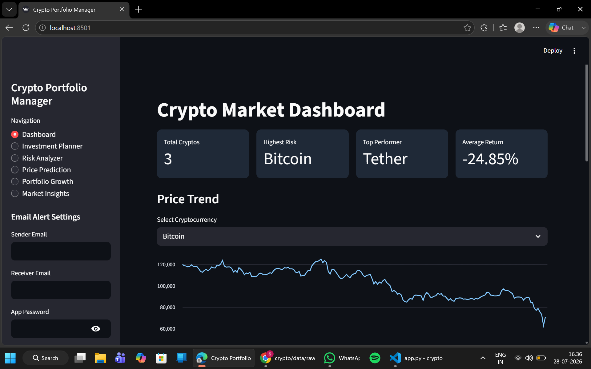
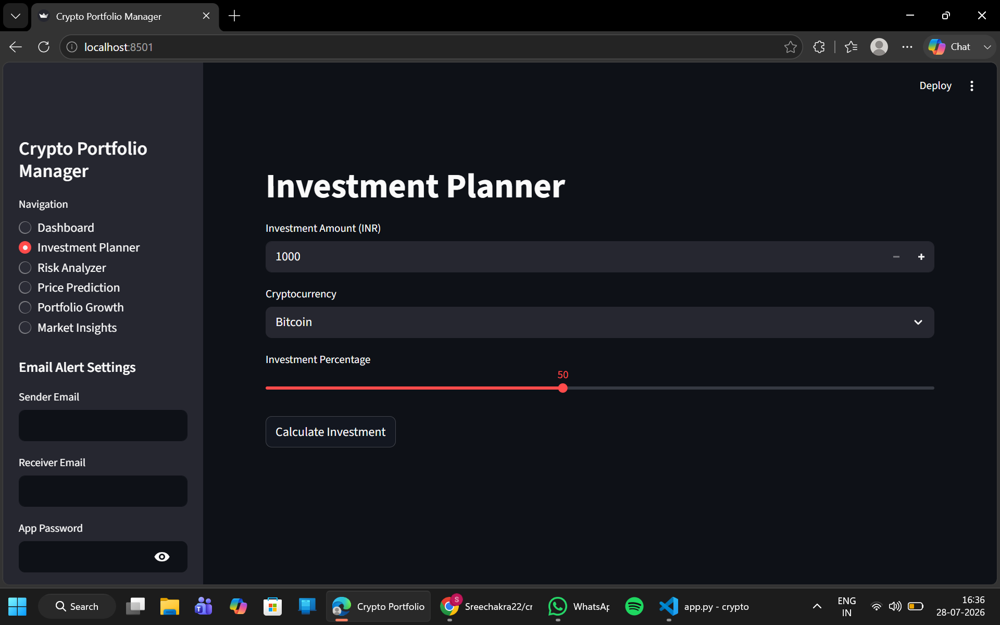
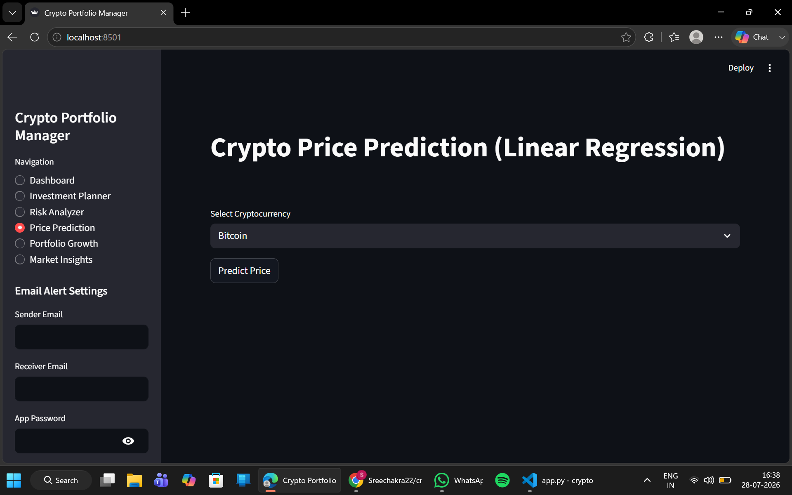

# 🚀 Crypto Portfolio Manager

A web-based Cryptocurrency Portfolio Management System built using **Python** and **Streamlit** that helps users analyze investments, predict future prices, optimize portfolios, and receive automated email alerts for high-risk assets.

---

## 📌 Project Overview

Crypto Portfolio Manager allows users to:

- 💰 Plan cryptocurrency investments
- 📊 Analyze investment risk
- 📈 Predict future prices using Linear Regression
- 📉 Monitor portfolio growth
- 📧 Receive automatic email alerts for high-risk investments
- 📂 Generate portfolio reports
- 📊 Visualize investment data through interactive charts

---

## ✨ Features

- Dashboard
- Investment Planner
- Risk Analyzer
- Price Prediction (Linear Regression)
- Portfolio Growth Analysis
- Portfolio Optimization
- Market Insights
- Email Alert System
- CSV Report Generation

---

## 🛠️ Technologies Used

- Python
- Streamlit
- Pandas
- NumPy
- Matplotlib
- Scikit-Learn
- SMTP
- Threading

---

## 📂 Project Structure

```
Crypto-Portfolio-Manager
│
├── app.py
├── requirements.txt
├── README.md
├── .gitignore
│
├── assets/
│   ├── dashboard.png
│   ├── planner.png
│   ├── risk.png
│
├── data/
│   ├── raw/
│   └── processed/
│
├── scripts/
│   ├── investment_mix_calculator.py
│   ├── risk_analysis_system.py
│   ├── portfolio_optimizer.py
│
└── models/
```

---

## 📈 Modules

### Milestone 1
- Data Collection
- Data Cleaning
- Exploratory Data Analysis

### Milestone 2
- Investment Mix Calculator
- Manual Investment Planning
- Risk Preference Selection

### Milestone 3
- Risk Analysis
- Trend Prediction
- Email Alerts
- Report Generation

### Milestone 4
- Portfolio Optimization
- Portfolio Growth
- Linear Regression Prediction
- Interactive Dashboard

---

## 📊 Machine Learning

Linear Regression is used to forecast future cryptocurrency prices based on historical price trends.

---

## 🚀 How to Run

Clone the repository

```bash
git clone https://github.com/YourUsername/Crypto-Portfolio-Manager.git
```

Go inside project

```bash
cd Crypto-Portfolio-Manager
```

Install dependencies

```bash
pip install -r requirements.txt
```

Run

```bash
streamlit run app.py
```

---

## 📷 Screenshots

### Dashboard



### Investment Planner



### Price Prediction



---

## 👨‍💻 Developed By

**Sreechakra Kommera**

B.Tech Computer Science Engineering

CMR Institute of Technology
